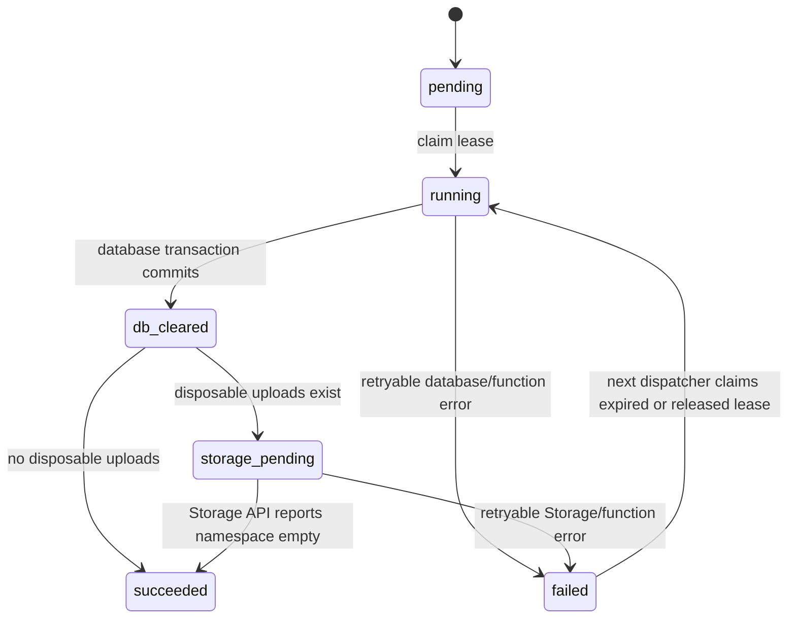

# Daily reset contract

Status: Architecture contract only in Phase 2.1. No database schema, cron job, Edge Function, or remote migration is created here.

## Schedule and logical day

- The user-facing target is 00:00 in the IANA timezone `Asia/Manila`.
- A planned Supabase Cron dispatcher runs every 15 minutes using `*/15 * * * *`.
- The coordinator calculates the current Manila date with timezone-aware PostgreSQL operations. It must not rely on a hard-coded UTC offset.
- Each app has at most one successful reset for each logical Manila date. Missed work remains due and is retried after recovery.

## State machine

Allowed durable states are `pending`, `running`, `db_cleared`, `storage_pending`, `succeeded`, and `failed`. A unique key on app plus logical Manila date prevents duplicate run records. A bounded lease (or advisory lock for the active transaction) prevents concurrent workers while allowing recovery after a crash.

## Reset sequence

1. Authenticate the scheduled server request and derive the logical Manila date.
2. Claim the app/day run only if it is due, retryable, or has an expired lease.
3. Execute one security-definer reset function owned by a non-login privileged role. Within one database transaction it removes visitor-created rows, restores fictional seed data, and upserts protected defaults without duplicating them.
4. Commit the database stage and persist `db_cleared`.
5. List only the app's disposable Storage namespace and delete objects through the Supabase Storage API in batches no larger than 1,000 objects.
6. Re-list and verify that the disposable namespace is empty. If not, persist `storage_pending` and retry.
7. Mark `succeeded` only after both the database transaction and Storage verification have completed.

Storage metadata must never be deleted directly with SQL. Supabase documents Storage API deletion as the supported path because it removes both the object and its metadata.

## Idempotency invariants

- Re-running a completed database stage results in the same fictional baseline.
- Seed rows use stable identifiers or conflict-safe upserts.
- Storage deletion treats a missing object as already cleared.
- A retry resumes from the last durable stage and never changes `succeeded` back to a partial state.
- Success is based on verification, not merely on an accepted delete request.
- One app's reset routine cannot reference another app's schema or object prefix.

## Protected default credentials

The approved credentials are public test data, not secrets. They must survive every reset and cannot be changed or deleted by visitors.

| App | Protected default |
| --- | --- |
| CN | `devpau` / `password` administrator |
| CN | `testteacher` / `password` teacher |
| CN | `teststudent` / `password` student |
| RCMI | Administrator page password `password` |
| Hours | Default password `password` |

Protection is layered:

- UI: hide or disable mutation controls and explain that preview credentials are fixed.
- API: omit protected credential fields from public mutation endpoints and reject protected-account deletion.
- Database: use RLS, restricted column/function grants, and a trigger or constrained mutation function that rejects protected identity or credential changes from demo roles.
- Reset: restore the exact approved hash/identity and role through an idempotent privileged function.

The final schema phase must test direct API attempts, not only UI behavior.

## Upload cleanup and limits

Only CN may upload. Files remain private and disposable. Enforcement must happen before upload authorization and be rechecked server-side:

- 2 MiB maximum per file.
- 5 files maximum per report.
- 20 files maximum per visitor session per Manila day.
- 100 MiB maximum across the CN demo namespace.

The reset coordinator lists and deletes through the Storage API in bounded batches, then verifies zero remaining disposable objects. Default assets, if any, use a separate protected prefix and are never included in the cleanup prefix.

## Interfaces and secret handling

- The reset coordinator accepts only authenticated scheduled/server calls. It is not callable with the anonymous browser key.
- Service-role credentials remain in Supabase Edge Function secrets. They must never appear in client bundles, logs, status payloads, or repository files.
- A public health view may expose only last successful reset, next expected reset, and a coarse healthy/delayed state.
- Sanitized internal events include app id, logical day, attempt, stage, duration, and error category.
- A future Netlify scheduled function may call a restricted health endpoint every six hours. It is a liveness watchdog, not the daily reset authority.

## Acceptance criteria for implementation phases

- Concurrent dispatcher calls produce one run per app/day.
- A forced failure after database commit resumes at Storage cleanup.
- More than 1,000 test objects are deleted across bounded batches.
- Protected users survive reset and all public change/delete attempts fail.
- Cross-app rows and objects remain untouched.
- Public clients cannot execute reset routines or read reset secrets.
- The visible timestamp is explicitly labeled `Asia/Manila`.
