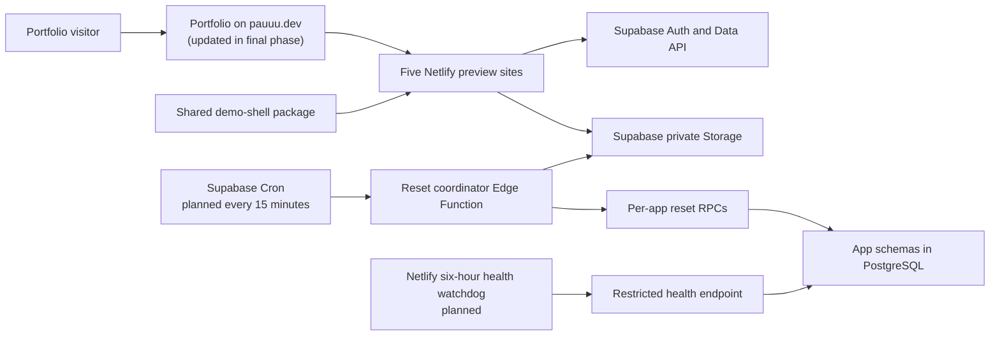

# Portfolio live demos: system design

Status: Approved contract for Phase 2.1. Runtime components shown as planned are not deployed in this sub-phase.

## Goals and constraints

The platform will publish five isolated portfolio previews on Netlify, backed by one dedicated Supabase Free project. Every preview must visibly identify itself as a disposable demo, expose only the approved test credentials, prevent those defaults from being changed, and clear visitor-created data every day at midnight in `Asia/Manila`.

The original project folders and the portfolio remain outside this workspace and unchanged. Only later, approved import phases may copy source into this workspace. Portfolio links are a final integration step.

The design targets free tiers and low-volume portfolio traffic. Free services provide no uptime guarantee; the platform must degrade safely and retry reset work after transient failures.

## High-level architecture

## Components and boundaries

| Component | Responsibility | Trust boundary |
| --- | --- | --- |
| Five Netlify sites | Serve each preview UI at its own `*-demo.pauuu.dev` hostname | Browser input is untrusted |
| `@pauuu-demo/demo-shell` | Render the persistent notice, public credential hints, and `noindex` defense | Contains no secrets or privileged operations |
| Supabase Auth/Data API | Authenticate demo users and expose only explicitly granted operations | RLS and grants are authoritative; browser keys are public |
| Per-app PostgreSQL schemas | Isolate app data and enforce invariants | Privileged reset functions are not granted to browser roles |
| Private Storage | Hold CN uploads within the approved limits | Objects are accessed through authenticated policies only |
| Reset coordinator | Orchestrate idempotent database and Storage cleanup | Service-role secret exists only in server-managed secrets |
| Health watchdog | Exercise a bounded endpoint every six hours to detect inactivity | Must not expose internal errors or privileged credentials |

One Supabase project is shared to remain within the free-only constraint, while each app receives its own schema, policies, reset routine, and storage namespace. This reduces cost but creates a shared project-level blast radius, so cross-schema grants are denied by default.

## Security design

- The shared banner uses Shadow DOM and text nodes, not HTML injection sinks.
- Every preview uses a static and runtime `noindex,nofollow,noarchive,nosnippet,noimageindex` directive.
- Default demo accounts are protected at UI, API, and database layers. The database remains authoritative even if a visitor bypasses the UI.
- Browser code receives only public configuration. Service-role and reset secrets remain in Supabase or Netlify server-side secret stores.
- New public tables are not automatically exposed. RLS, table grants, function execution grants, and Storage policies are explicit and least-privilege.
- Uploads are disabled except for CN. CN objects are private and subject to 2 MiB per file, 5 files per report, 20 files per session per day, and a 100 MiB global cap.
- Logs exclude passwords, access tokens, object contents, and raw personal data. Public status responses contain only coarse reset timestamps and state.

## Reliability and non-functional requirements

| Area | Contract |
| --- | --- |
| Reset objective | Target 00:00 local time in `Asia/Manila`; dispatcher checks every 15 minutes and retries incomplete work |
| Recovery | After a transient service recovery, the next dispatcher run should resume the unfinished logical day |
| Idempotency | Repeating the same logical-day reset cannot duplicate protected defaults or corrupt state |
| Capacity | Small public portfolio traffic; reject work before exceeding free-tier and CN upload limits |
| Availability | Best effort on free tiers; failures are visible as safe status, never as false reset success |
| Accessibility | Notice is keyboard-accessible, responsive, and announced as a note |
| Privacy | Demo-only warning; users are instructed not to enter real or sensitive data |
| Indexing | Demo hosts should not appear in search results; directives are defense in depth, not an access control |
| Observability | Record logical day, app, stage, attempt, timestamps, and sanitized error category |

## Failure modes

| Failure | Safe behavior | Recovery |
| --- | --- | --- |
| Cron invokes twice | Unique logical-day claim and lease prevent conflicting workers | Second invocation exits or resumes an expired lease |
| Database reset fails | Transaction rolls back; run is not marked complete | Retry on the next dispatcher tick |
| Database succeeds but Storage fails | State remains `storage_pending`; never report full success | Resume Storage deletion without repeating harmful work |
| Edge Function times out | Lease expires and another invocation resumes idempotently | Retry until verified complete |
| Storage contains more than one API batch | Delete in bounded batches and verify the namespace is empty | Continue in the same or later invocation |
| Default account mutation is attempted | Database policy/trigger rejects the protected-field change | UI displays a demo-account restriction |
| Free project is unavailable or paused | Demos fail closed and do not claim a reset succeeded | Watchdog records failure; normal requests or dashboard recovery restore service |
| Global CN storage cap is reached | New uploads are rejected before object creation | Daily cleanup frees disposable objects |

## Decisions and tradeoffs

Accepted decisions are in `docs/adr`. The main tradeoff is cost versus isolation: one Supabase project preserves the free-only goal but requires careful schema and privilege boundaries. The framework-neutral notice minimizes duplicated behavior across unlike projects, while per-app adapters remain responsible for visual placement and application-specific authorization.

## Official platform references

- Supabase Cron: https://supabase.com/docs/guides/cron
- Supabase Edge Functions: https://supabase.com/docs/guides/functions
- Supabase Storage object deletion: https://supabase.com/docs/guides/storage/management/delete-objects
- Netlify scheduled functions: https://docs.netlify.com/build/functions/scheduled-functions/
